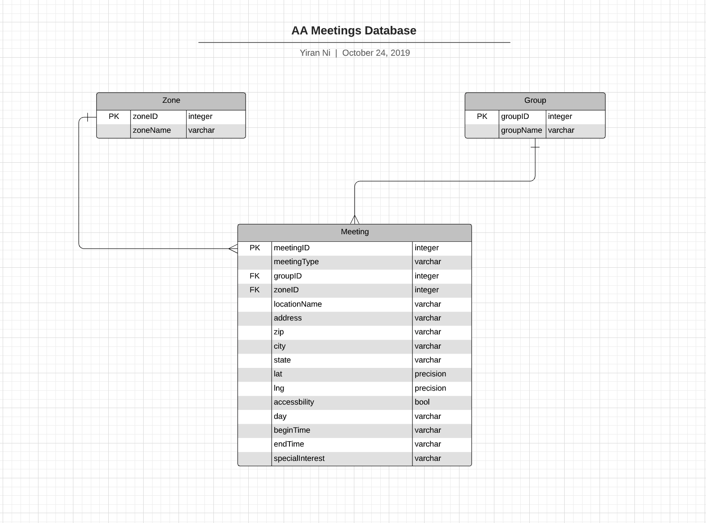
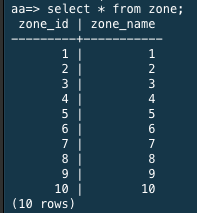
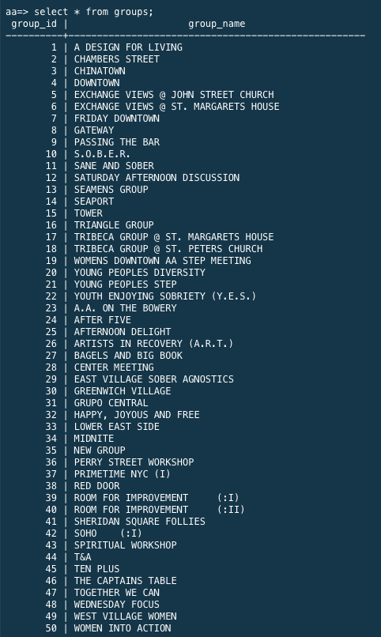
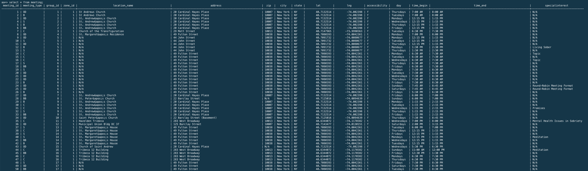
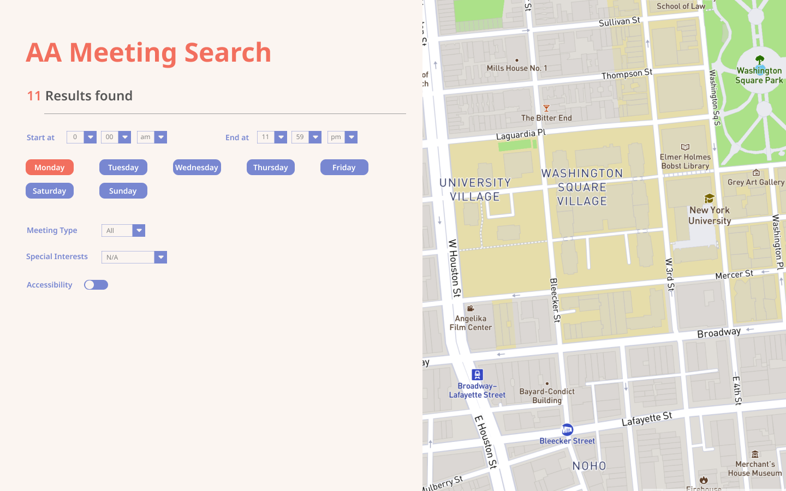

# Alcoholics Anonymous Meetings
## Introduction
Alcoholics Anonymous is a fellowship of peoople who share their experience, strength and hope with each other that they may solve their common problem and help others to recover from alcoholism. 

*Information found at https://www.nyintergroup.org/what-is-aa/.*

This project focuses on Alcoholics Anonymous Meetings in New York, aiming to ease the user experience of searching and filtering relevant meetings.

---

## Original Website
The original websites are consisted of 10 HTML pages which refers to 10 different zones with information of each meeting.

Examples can be found here:
 
http://parsons.nyc/aa/m01.html

http://parsons.nyc/aa/m02.html

http://parsons.nyc/aa/m03.html

http://parsons.nyc/aa/m04.html

http://parsons.nyc/aa/m05.html

http://parsons.nyc/aa/m06.html

http://parsons.nyc/aa/m07.html

http://parsons.nyc/aa/m08.html

http://parsons.nyc/aa/m09.html

http://parsons.nyc/aa/m10.html


### Issues Of Original Website
1. Filter/ search functions not working.
2. Too much information on one page. Users have to read through the entire page to find their interested meetings.
3. Missing sense of locations. Even though infomration of locations and addresses are provided, users still do not know where they are.

### Ideal Solution
1.  Add filter/ search functions.
2. Only presents information based on filtering/ searching result.
3. Include a map and present the location of meetings on the map based on the filtering/searching result.

---

## Process
### 1. Scripting Data
For each HTML page, using Node.js request module `require('request')` to request the HTML scripts and file system module `require('fs')` to write the HTML scripts into local text files.
```ruby
let url = `url of the html page`;
let writePath = `path to local txt file`;
request(url, function(error, response, body){
    if (!error && response.statusCode == 200) {
        fs.writeFileSync(writePath, body, function (err) {
            if (err) {
                throw err; 
            }
        }); 
        console.log(writePath + ' file created')
    } else {console.log("Request failed!")}
});
```
### 2. Parsing Data
The requested data saved in test files is inconsistent and difficult to manipulate. Parsing data and writing it into a JSON file is helpful to get rid of unnecessary data.

The structure of the JSON file is:
``` ruby
[
/* array includes all 10 zones */
{
    zone: 1, 
    groups:[
    /* array includes all groups holding meeting in this zone */
    {
        "group":"",
        "locations":"",
        "address":"",
        "city":"",
        "state":"",
        "zip":"",
        "accessibility":true/false,
        "allMeetings":[
            /* array includes all meeting in this group */
            {
                "day":"",
                "beginTime":"",
                "endTime":"",
                "meetingType":"",
                "specialInterest":""
            },
            {
                "day":"",
                "beginTime":"",
                "endTime":"",
                "meetingType":"",
                "specialInterest":""
            }]
    }, 
    {
        "group":"",
        "locations":"",
        "address":"",
        "city":"",
        "state":"",
        "zip":"",
        "accessibility":true/false,
        "allMeetings":[
            /* array includes all meeting in this group */
            {
                "day":"",
                "beginTime":"",
                "endTime":"",
                "meetingType":"",
                "specialInterest":""
            },
            {
                "day":"",
                "beginTime":"",
                "endTime":"",
                "meetingType":"",
                "specialInterest":""
            }]
    },
    ...
    {
        "group":"",
        "locations":"",
        "address":"",
        "city":"",
        "state":"",
        "zip":"",
        "accessibility":true/false,
        "allMeetings":[
            /* array includes all meeting in this group */
            {
                "day":"",
                "beginTime":"",
                "endTime":"",
                "meetingType":"",
                "specialInterest":""
            },
            {
                "day":"",
                "beginTime":"",
                "endTime":"",
                "meetingType":"",
                "specialInterest":""
            }]
    }]
    }, 
    {zone: 2, groups:[]},
    ...
    {zone: 10, groups:[]}
]
```
To be short, the structure is file > zones > groups > meetings > meeting details.

### 3. Geocoding Data
With address data of each group saved in JSON file, using [TAMU Geo Services](https://geoservices.tamu.edu/) to Geocode each address and merge the requested API result to the current meeting data.

An example of one meeting group is following:

```ruby
{
        "group": "A DESIGN FOR LIVING ",
        "locations": "St Andrews Church",
        "address": "20 Cardinal Hayes Place",
        "city": "New York",
        "state": "NY",
        "zip": "10007",
        "accessibility": false,
        "allMeetings": [
            {
                "day": "Thursdays",
                "beginTime": "7:00 AM ",
                "endTime": "8:00 AM ",
                "meetingType": "OD",
                "specialInterest": "N/A"
            },
            {
                "day": "Tuesdays",
                "beginTime": "7:00 AM ",
                "endTime": "8:00 AM",
                "meetingType": "B",
                "specialInterest": "N/A"
            }
        ],
        "lat": "40.7132514",
        "lng": "-74.002398"
    }
```

### 4. Store Data in SQL Database
Due to the large amount of the data, storing data in SQL database could allow users to quickly and efficiently retrieve any records from the database. It is also easier to manage the data with SQL queries.

The following is the RDS model for this project:



Examples of SQL querying results are following:







### 5. UI Design
Based on the ideal solution described above, I came up with the following design.



**Function Walk Through:**
1. Time Filter
2. Day Filter
3. Meeting Type Filter
4. Special Interests Filter
5. Accessibility Filter
6. Map


